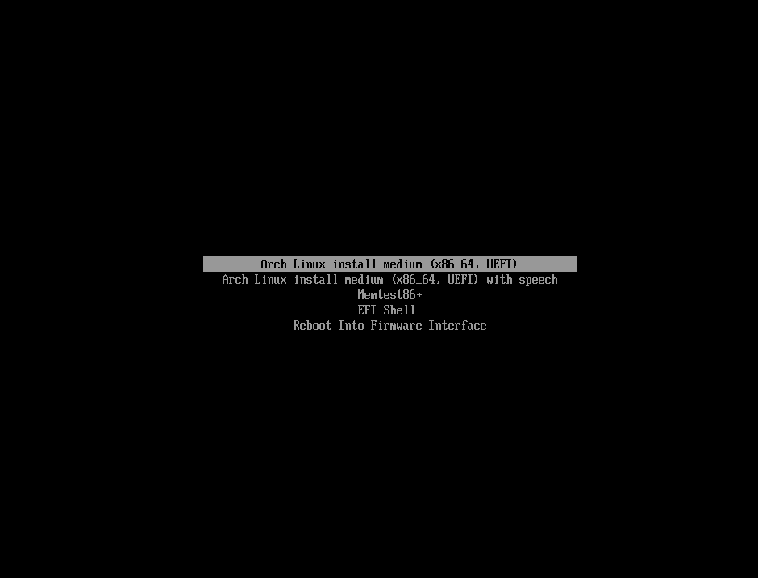

這篇教學主要是幫助新手安裝`Arch Linux`系統的教程。

### 1. 獲取 Iso 檔案

至 [Arch Linux 官網](https://archlinux.org/download/)，找到合適的鏡像站，我這邊選擇台灣。

### 2. 開始安裝 Arch Linux

:::tip
這邊我是使用乙太網路而不是 wifi，避免驅動問題。
:::

#### 2-1. 開機

1. 選擇 `Arch Linux install medium (x86_64, UEFI)`
   
2. 進到 terminal 介面後如果你是使用乙太網路，系統應該會自動連上網路，可使用下面指令來確認有無連線到網路。

```bash
  ping -c 4 8.8.8.8 # Google 的 DNS
```

3. 檢查是否為 UEFI 模式開機，如果是則會回傳 "64"。若顯示`No such file or directory`的話，則重新開機進到 BIOS 啟用 UEFI 並重新來過。

```bash
cat /sys/firmware/efi/fw_platform_size
```

#### 2-2. 修改來源

為解決有些地區從官方 Server 上下載速度太慢的問題，可將套件庫改成離自己較近的站點。
:::note
可參考[mirrorlist](https://archlinux.org/mirrorlist/)網站
:::

1. 編輯 `mirrorlist`

```bash
vim /etc/pacman.d/mirrorlist
```

```bash
# Arch Linux repository mirrorlist
# Generated on 2024-12-23
# Taiwan mirror
Server = <http://mirror.archlinux.tw/ArchLinux/$repo/os/$arch>
Server = <https://mirror.archlinux.tw/ArchLinux/$repo/os/$arch>
Server = <http://archlinux.ccns.ncku.edu.tw/archlinux/$repo/os/$arch>
Server = <https://archlinux.ccns.ncku.edu.tw/archlinux/$repo/os/$arch>
Server = <http://tw.mirrors.cicku.me/archlinux/$repo/os/$arch>
Server = <https://tw.mirrors.cicku.me/archlinux/$repo/os/$arch>
Server = <http://free.nchc.org.tw/arch/$repo/os/$arch>
Server = <https://free.nchc.org.tw/arch/$repo/os/$arch>
Server = <https://ncuesaweb.ncue.edu.tw/linux/archlinux/$repo/os/$arch>
Server = <http://archlinux.cs.nycu.edu.tw/$repo/os/$arch>
Server = <https://archlinux.cs.nycu.edu.tw/$repo/os/$arch>
Server = <http://ftp.tku.edu.tw/Linux/ArchLinux/$repo/os/$arch>
Server = <http://mirror.twds.com.tw/archlinux/$repo/os/$arch>
Server = <https://mirror.twds.com.tw/archlinux/$repo/os/$arch>
Server = <http://ftp.yzu.edu.tw/Linux/archlinux/$repo/os/$arch>
Server = <https://ftp.yzu.edu.tw/Linux/archlinux/$repo/os/$arch>
```

2. 同步套件庫，沒輸出錯誤訊息就表示成功連線。

```bash
pacman -Syy
```

#### 2-3. 硬碟分割

有`cfdisk`, `fdisk`, `gdisk`指令可以使用, 這邊使用 `fdisk`來分割硬碟。

1. 查看硬碟

```bash
fdisk -l
```

2. 輸入上面指令後會看到`/dev/sda`這樣的裝置代號。SSD 或 HDD 通常是顯示為`/dev/sda`，Nvme 為`/dev/nvme0n1`。
   :::Note
   列表會包含硬碟和開機隨身碟，得依照空間來辨別硬碟。
   :::

```bash
Disk /dev/sda: ......
  or
Disk /dev/nvme0n1: ......
```

3. 選擇要安裝系統的硬碟

```bash
fdisk /dev/sda # 我這邊是SSD
```

4. 刪除全部分區，建立 GPT 分割表

```bash
Command (m for help): g
Created a new GPT disklabel (GUID: 836C0C52-8778-445F-A61C-EC693DB1F9BE).
```

5. 新增 UEFI 開機的第一個分區, 並將分區類型切換

```bash
Command (m for help): n
Partition number (1-128, default 1): 1
First sector (2048-209715166, default 2048): # 這邊使用預設，直接按enter
Last sector, +/-sectors or +/-size{K,M,G,T,P} (2048-209715166, default 209713151): +512MB # EFI分區大小(MB)，個人常用300~600MB區間

Created a new partition 1 of type 'Linux filesystem' and of size 488MB.

Command (m for help): t
Selected partition 1
Partition type or alias (type L to list all): uefi # 切換為EFI
Changed type of partition 'Linux filesystem' to 'EFI System'.
```

:::Note
若有遇到 `Do you want to remove the signature?` 的問題則輸入 yes 即可
:::

7. 建立 Swap 分區(虛擬記憶體)，建議為 RAM 的 2 倍大小，並將分區類型切換為 swap

```bash
Command (m for help): n
Partition number (2-128, default 2): 2
First sector (2561-209715166, default 4096): # 可直接enter使用預設
Last sector, +/-sectors or +/-size{K,M,G,T,P} (4096-209715166, default 209713151): +16GB # 這裡我RAM是8G，所以分配16G的Swap
Created a new partition 2 of type 'Linux filesystem' and of size 14.9 GiB.

Command (m for help): t
Partition number (1,2, default 2): 2
Partition type or alias (type L to list all): swap # 切換為swap類型
Changed type of partition 'Linux filesystem' to 'Linux swap'.
```

8. 將剩下的空間都分配給根目錄

```bash
Command (m for help): n
Partition number (3-128, default 3): 3
First sector (32253952-209715166, default 32253952):
Last sector, +/-sectors or +/-size{K,M,G,T,P} (32253952-209715166, default 209713151):
Created a new partition 3 of type 'Linux filesystem' and of size 84.6 GiB.
```

:::tip[補充]
也可以另外把硬碟空間分配在其他資料夾，例如:`\home`...
:::

9. 將改動寫入硬碟

```bash
Command (m for help): w
The partition table has been altered.
Calling ioctl() to re-read partition table.
Syncing disks.
```

10. 查看硬碟分區狀況

```bash
root@archiso ~ # fdisk -l
Disk /dev/sda: 100 GiB, 107374182400 bytes, 209715200 sectors
Disk model: Virtual Disk
Units: sectors of 1 * 512 = 512 bytes
Sector size (logical/physical): 512 bytes / 4096 bytes
I/O size (minimum/optimal): 4096 bytes / 4096 bytes
Disklabel type: gpt
Disk identifier: 836C0C52-8778-445F-A61C-EC693DB1F9BE

Device        Start       End   Sectors  Size Type
/dev/sda1  31254528  32253951    999424  488M EFI System
/dev/sda2      4096  31254527  31250432 14.9G Linux swap
/dev/sda3  32253952 209713151 177459200 84.6G Linux filesystem
```

11. 硬碟格式化並建立檔案系統

:::Note
EFI 分區為 FAT32，根目錄分區使用 EXT4。
:::

```bash
root@archiso ~ # mkfs.fat -F32 /dev/sda1
mkfs.fat 4.2 (2021-01-31)

root@archiso ~ # mkswap /dev/sda2
Setting up swapspace version 1, size = 14.9 GiB (16000217088 bytes)
no label, UUID=543585a3-9f4b-4592-945b-cbad60e63cce
root@archiso ~ # swapon /dev/sda2

root@archiso ~ # mkfs.ext4 /dev/sda3
mke2fs 1.47.1 (20-May-2024)
Discarding device blocks: done
Creating filesystem with 22182400 4k blocks and 5545984 inodes
Filesystem UUID: d1015933-a39c-40b1-8025-55e3cad628a2
Superblock backups stored on blocks:
        32768, 98304, 163840, 229376, 294912, 819200, 884736, 1605632, 2654208,
        4096000, 7962624, 11239424, 20480000

Allocating group tables: done
Writing inode tables: done
Creating journal (131072 blocks): done
Writing superblocks and filesystem accounting information: done
```

12. 將根目錄分區掛載到/mnt

```bash
mount /dev/sda3 /mnt
```

#### 2-4. 安裝 Linux 核心和最小系統

1. 掛載 EFI 分區

```bash
mkdir /mnt/boot
mount /dev/sda1 /mnt/boot
```

2. 安裝`base`、`linux`、`linux-firmware`

```bash
pacstrap -K /mnt base linux linux-firmware\
```

3. 使用`genfstab`設定硬碟掛載的規則

```bash
genfstab -U /mnt >> /mnt/etc/fstab
```

:::tip
可使用`cat`命令讀取`/mnt/etc/fstab`來查看掛載狀況
:::

4. 用 chroot 來進到系統

```bash
arch-chroot /mnt
```

#### 2-5. 安裝驅動

:::tip
若遇到金鑰問題，可手動刷新 PGP 信任密鑰

```bash
pacman-key --init
pacman-key --populate archlinux
```

:::

- 顯示卡驅動

  1. Intel GPU

  ```bash
  pacman -S intel-media-driver vulkan-intel
  ```

  2. AMD GPU

  ```bash
  pacman -S vulkan-radeon libva-mesa-driver mesa-vdpau
  ```

  3. Nvidia GPU

  ```bash
  pacman -S linux-headers nvidia-dkms nvidia-settings
  ```

- `linux-firmware`

  有些含在 Linux 核心的驅動會在開機後自動載入。

  ```bash
  pacman -S linux-fireware
  ```

#### 2-6. 設定服務

1. 設定時區及硬體時鐘

```bash
ln -sf /usr/share/zoneinfo/Asia/Taipei /etc/localtime #台灣台北
hwclock --systohc
```

2. 設定語言
   :::Warning
   如果你是想安裝 GUI 的話可切換中文語言，如果不是建議略過，因為純 cli 部分中文會出問題，除非你用 ssh 連。
   :::

- 編輯語言檔案 `/etc/locale.gen` (這邊我加入中文)

  ```bash
  zh_TW.UTF-8 UTF-8
  ```

- 生成且設定系統語言

  ```bash
  locale-gen
  echo "LANG=zh_TW.UTF-8" >> /etc/locale.conf
  ```

3. 設定主機名

```bash
  echo "kamin-arch" >> /etc/hostname
```

4. 建立 host 檔案

```bash
echo "127.0.0.1 localhost" >> /etc/hosts
echo "::1 localhost" >> /etc/hosts
echo "127.0.1.1 kamin-arch" >> /etc/hosts # 更換成自己設定的名稱
```

5. 安裝常用軟體

```bash
pacman -S NetworkManager git vim fakeroot base-devel #工具
pacman -S noto-fonts-cjk noto-fonts-emoji #中文字體
```

5. 設定開機自動啟動的服務

我這裡開啟`NetworkManager`, `sshd`，可自行根據設定

```bash
systemctl enable NetworkManager.service
systemctl enable sshd.service
```

#### 2-7. 使用者設定

- 更改 root 密碼

  ```bash
  passwd root
  ```

- 建立一般使用者帳戶"user"(名字自取)，加入 users、wheel、audio、video、storage 群組，並修改密碼

  ```bash
  useradd -m -g users -G wheel,audio,video,storage -s /bin/bash kamin
  passwd kamin
  ```

- 編輯 `/etc/sudoers`, 賦予一般使用者 `sudo` 權限

  ```bash
  user ALL=(ALL:ALL) ALL
  ```

#### 2-8. 安裝開機引導

1. 安裝 GRUB 和 efibootmgr 套件

```bash
pacman -S grub efibootmgr
```

2. 將 EFI 分區掛載到`/boot`目錄

```bash
mount /dev/sda1 /boot
```

3. 安裝 GRUB 至 EFI 分區

```bash
grub-install --target=x86_64-efi --bootloader-id=GRUB --efi-directory=/boot
grub-mkconfig -o /boot/grub/grub.cfg
```

4.檢查`/boot`下是否有成功安裝 GRUB 和 Linux 核心

```bash
ls /boot
```

5. 安裝完成，退出 chroot，取消掛載，關機
