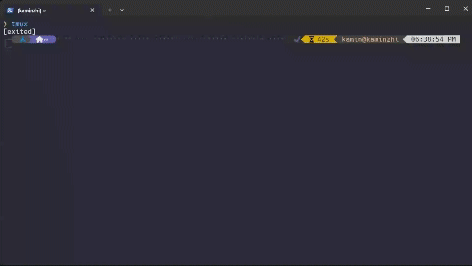

###### 在別人的拐騙下使我入了 Vim 和 Tmux 這個大坑進行Coding

## Neovim

Neovim 是 Vim 的一個分支，提供了更強大的編輯功能和許多插件支持，讓我可以根據需要進行插件自訂。它的啟動速度快，資源消耗少，非常適合用來處理大型專案。還有就是只要有terminal和網路我就可以遠端連上去工作。

## Tmux

Tmux 是一個終端多工器，讓我可以在一個session中打開多個終端視窗或分頁，這樣就能輕鬆在專案檔案、編譯輸出和日誌之間切換。為什麼不用neovim的呢，因為我懶得換_(:3 」∠ )_

(還有一個原因使我用這套組合，就是這樣看起來很帥_(:3 」∠ )_)