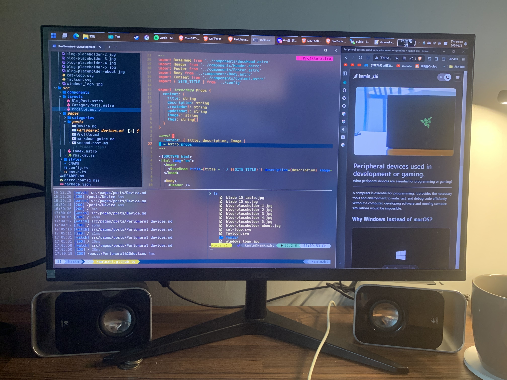
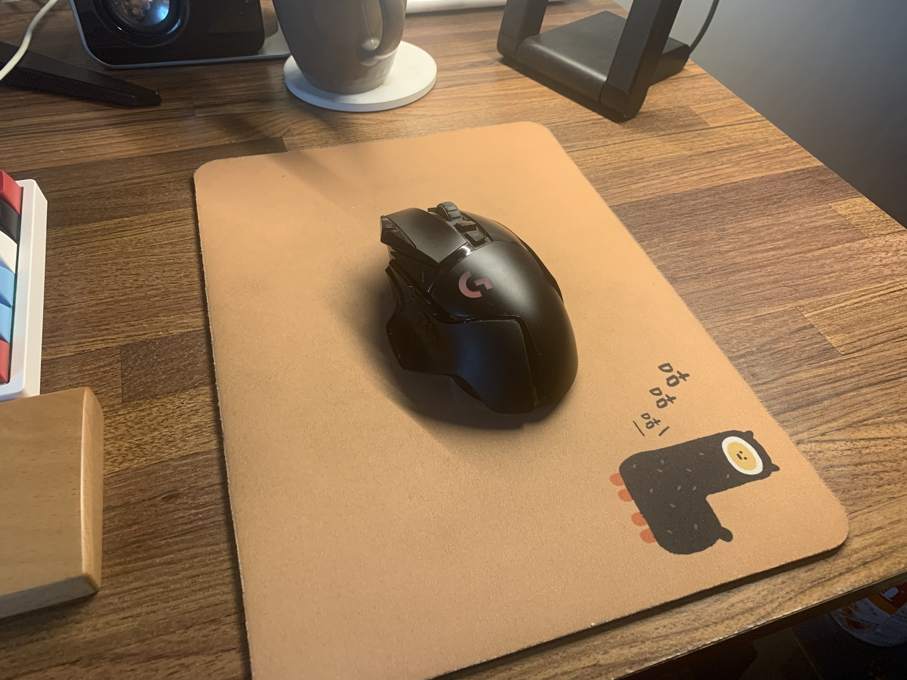
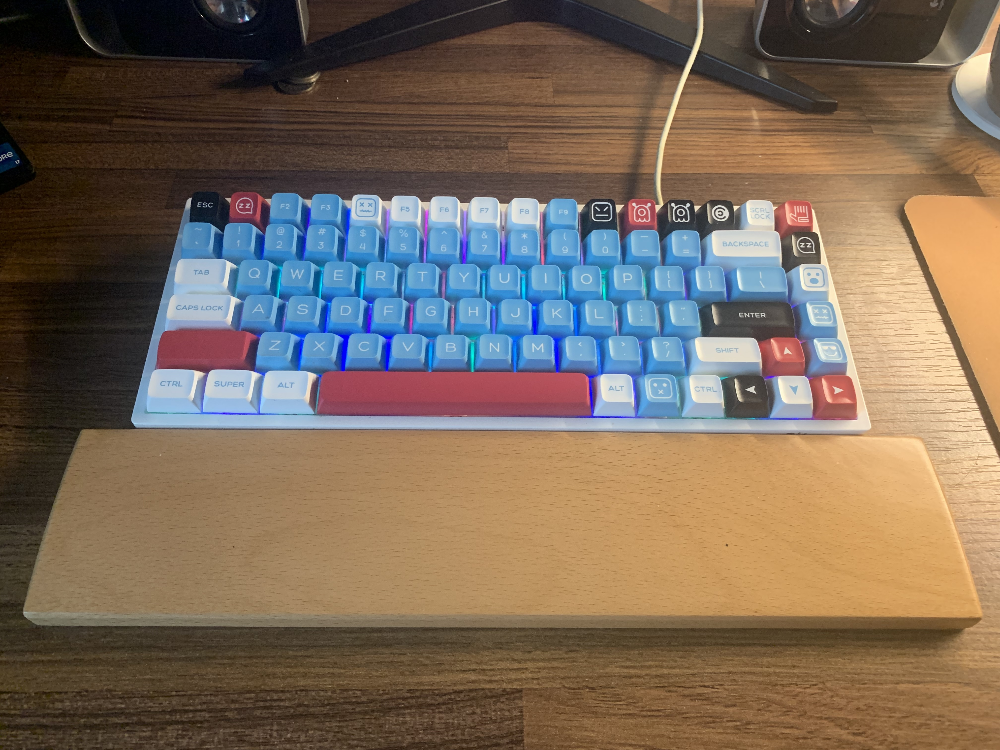
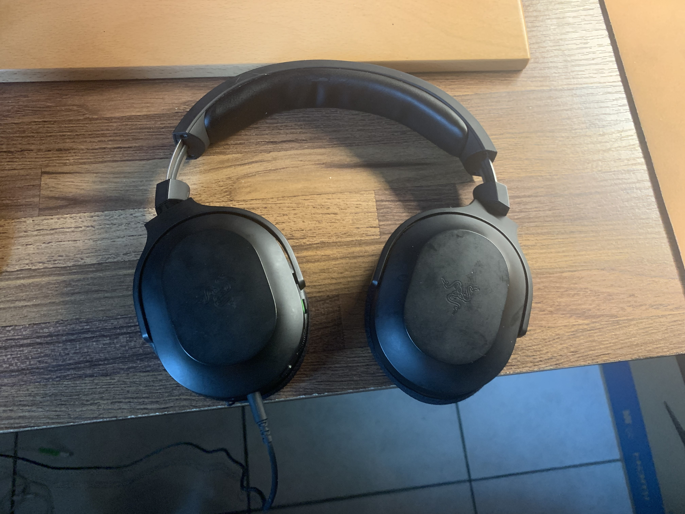
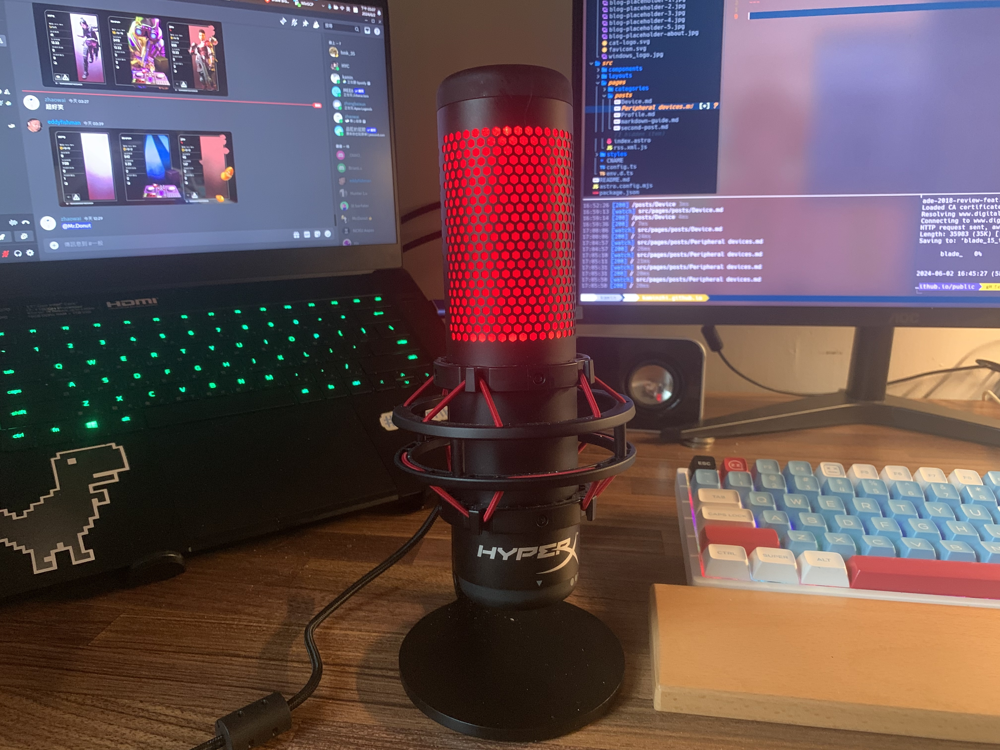
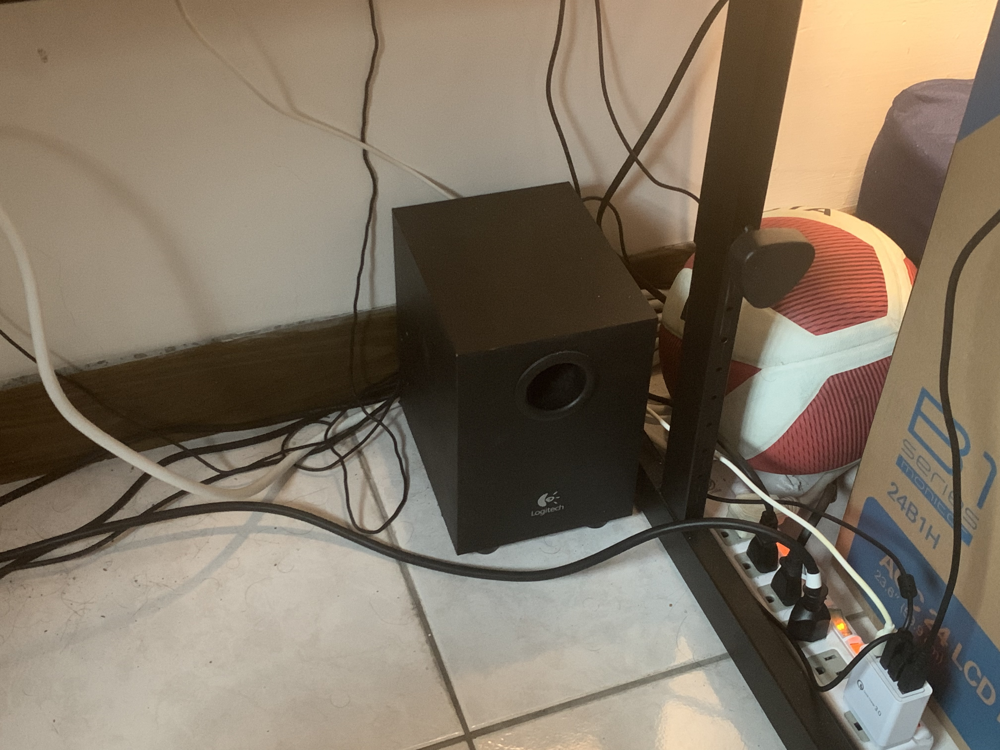
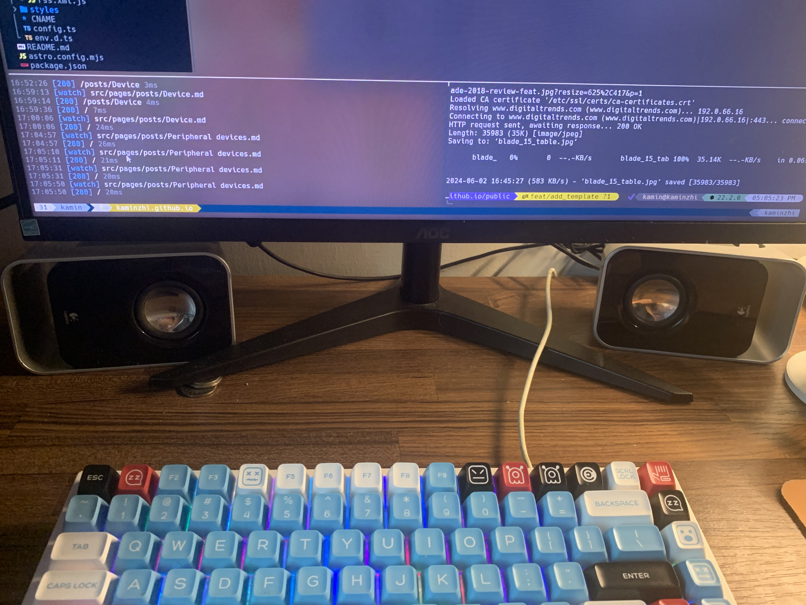

下面這些是這兩年來我身邊用於開發及打遊戲的設備(作為一個瓦以及麥塊玩家)

---

## 螢幕：AOC 24B1H

雖然這款螢幕的品質稱不上頂尖，但至少它的色彩沒有太大偏移，作為文書青遊戲也夠用，而且我已經使用六年了，沒有遇到什麼重大問題。  
（不過最近可能是接觸不良，接口有時會出現連接不穩的情況。）

---

## 滑鼠：Logitech G502 Lightspeed

這款滑鼠無論是用於工作還是遊戲都非常方便。可調配重塊的設計能夠調整到最適合自己的重量。

---

## 鍵盤：Royal Kludge RK84 Pro

鍵盤的亮點在於支援三種平台連線、可熱插拔軸體，且價格低。打字手感還行(紅軸)，而我最喜歡的是它保留了 F1 到 F12 鍵以及 HOME 和 END 鍵的功能。

---

## 耳機：Razer Barracuda X

音質的表現一般，唯一的優點是支援無線連接，不過我大多數時候還是選擇有線模式使用。

---

## 麥克風：HyperX QuadCast

這款麥克風有幾個相當便利的功能。首先，它具備觸控式靜音功能，只需輕觸頂部即可快速靜音，無需手忙腳亂地按按鈕。此外，它內建防噴網，並提供四種錄音模式，用於各種不同的使用環境。錄音效果相當不錯，能夠呈現清晰、純淨音質。

---

## 喇叭：Logitech LS21

便宜的 2.1 聲道喇叭，音質表現中低那邊，低音表現普通，買它純粹便宜。
