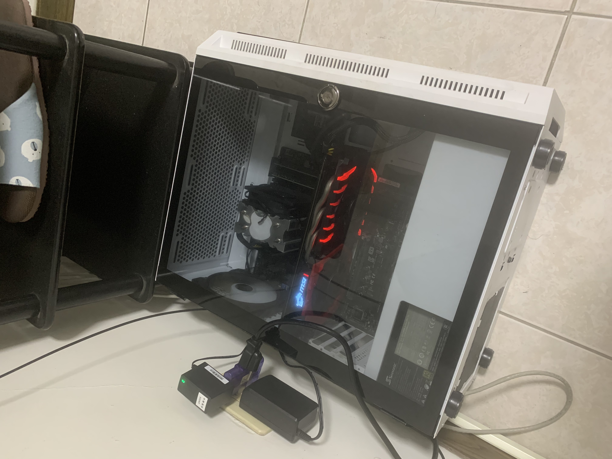

## 我的反思

這台主機是我自己組裝的，使用了一些二手零件，包括一些從之前的組裝中剩下來的。因為這些零件還能用，所以組裝成本非常低，總共花費不到 NT$4000（不算硬碟）目前這台電腦放在我住處的客廳，24hr運行，幾乎不會關機。

---

## 伺服器連結

- 雲端硬碟：[Nextcloud](https://cloud.kaminzhi.com/)
- ~~影片/動漫串流平台：[Jellyfin](https://movie.kaminzhi.com/)~~ (已關閉)
- Minecraft伺服器：mc.kaminzhi.com (模組伺服器)
- Discord 音樂機器人：目前自用中

---

## 機器配置

#### 系統

- [Arch Linux (linux-lts)](https://zh.wikipedia.org/zh-tw/Arch_Linux)

#### 處理器

- i5-6500

#### 主機板

- Asus P10S WS C236

#### 記憶體（非 ECC 記憶體）

> | 容量  | 頻率   | 數量  |
> | :--:  | :----: | :---: |
> | 16G   | 2666   | X1    |
> | 8G    | 2666   | X1    |

#### 顯示卡

- ~~Nvidia GTX 1060 6G~~ (隨著串流平台關閉已移除)

